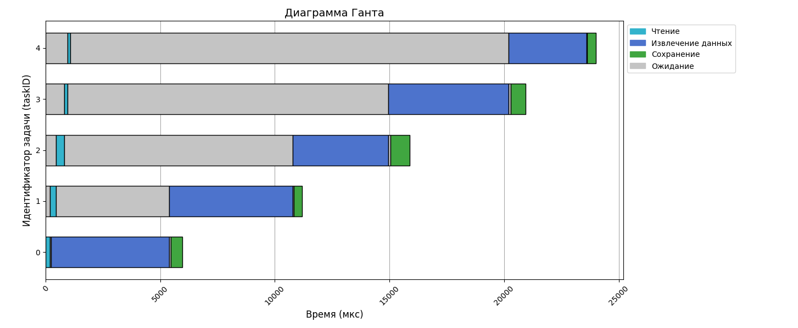
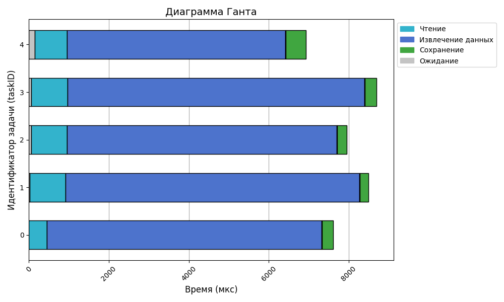

# 1 worker per stage

> tasks = 5

> workers = 1

> channel length = 10


```bash
2024/12/14 15:03:23 INFO logTask: task with id 0 has been received
2024/12/14 15:03:23 INFO logTask: task with id 1 has been received
2024/12/14 15:03:23 INFO logTask: task with id 2 has been received
2024/12/14 15:03:23 INFO logTask: task with id 3 has been received
2024/12/14 15:03:23 INFO logTask: task with id 4 has been received
--------------------------
Statistics
--------------------------
Workers: 1 
Channel length: 10 
Num of tasks: 5 
Avg task lifetime: 16.800153ms
+-----------------+------------------+---------------------+
| STAGE NAME      | AVG WAITING TIME | AVG PROCESSING TIME |
+-----------------+------------------+---------------------+
| readFileContent |        431.492µs |            83.263µs |
| parseRecipe     |       3.668214ms |           777.344µs |
| saveRecipe      |          2.012µs |           105.906µs |
+-----------------+------------------+---------------------+
```



# 5 workers per stage

> tasks = 5

> workers = 5

> channel length = 10

```bash
2024/12/14 15:00:42 INFO logTask: task with id 4 has been received
2024/12/14 15:00:42 INFO logTask: task with id 0 has been received
2024/12/14 15:00:42 INFO logTask: task with id 2 has been received
2024/12/14 15:00:42 INFO logTask: task with id 1 has been received
2024/12/14 15:00:42 INFO logTask: task with id 3 has been received
--------------------------
Statistics
--------------------------
Workers: 5 
Channel length: 10 
Num of tasks: 5 
Avg task lifetime: 7.936889ms
+-----------------+------------------+---------------------+
| STAGE NAME      | AVG WAITING TIME | AVG PROCESSING TIME |
+-----------------+------------------+---------------------+
| readFileContent |         12.169µs |           180.236µs |
| parseRecipe     |            721ns |          1.485819ms |
| saveRecipe      |          1.193µs |            57.942µs |
+-----------------+------------------+---------------------+
```


