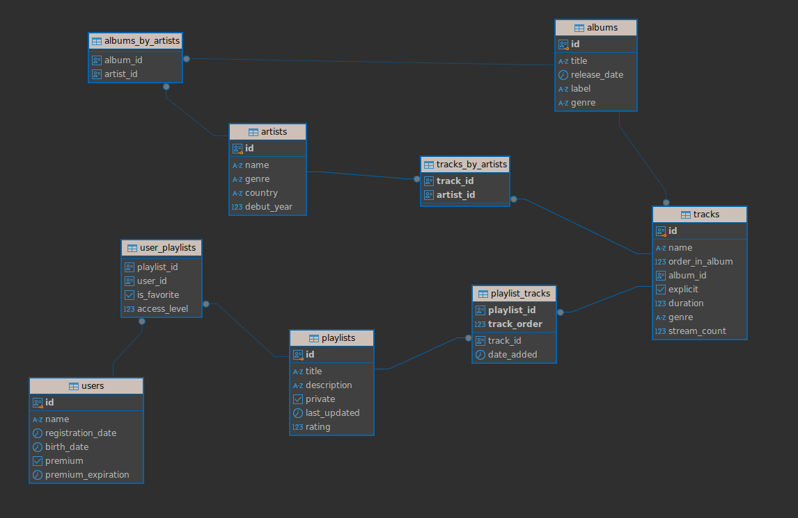
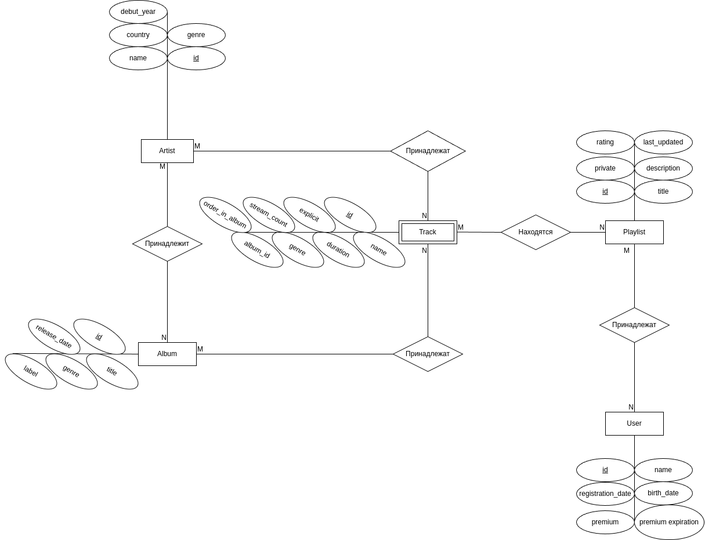

# Creation and filling of the music service database

Note: generation takes place without transactions

Note: Many things are hardcoded, but if desired, it can be fixed at any time

Note: The CSV is being recreated. The data is appended to the postgres (non-unique ones are skipped)

# Diagrams

